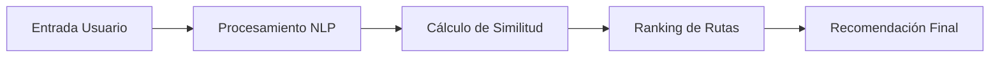

# Qoriyachay Backend API

<div align="center">


[](https://railway.app)


*Sistema de recomendación de rutas de aprendizaje impulsado por IA*

</div>

## 📋 Índice
- [Descripción General](#-descripción-general)
- [Sistema de IA](#-sistema-de-ia)
- [Características](#-características)
- [Requisitos Previos](#-requisitos-previos)
- [Instalación](#-instalación)
- [Configuración](#-configuración)
- [Uso](#-uso)
- [API Endpoints](#-api-endpoints)
- [Tecnologías](#-tecnologías)
- [Despliegue](#-despliegue)
- [Contribución](#-contribución)

## 🎯 Descripción General

Qoriyachay es una API de recomendación inteligente que utiliza procesamiento de lenguaje natural para sugerir rutas de aprendizaje personalizadas basadas en el perfil académico del estudiante. El sistema analiza múltiples factores como la carrera, intereses y nivel académico para proporcionar recomendaciones precisas y relevantes.

## 🧠 Sistema de IA

### Arquitectura del Sistema de Recomendación

El sistema utiliza un enfoque híbrido que combina:

1. **Procesamiento de Lenguaje Natural (NLP)**
   ```javascript
   // Implementado con Natural.js
   const classifier = new natural.BayesClassifier();
   classifier.addDocument(studentProfile, recommendedPath);
   ```

2. **Sistema de Puntuación Multifactorial**
   ```javascript
   Score = (NLP_Score * 0.6) + (Profile_Similarity * 0.4)
   
   Profile_Similarity = {
     Career_Match: 40%,    // Coincidencia de carrera
     Interests_Match: 40%, // Alineación de intereses
     Level_Factor: 20%     // Adecuación al ciclo
   }
   ```

### Flujo de Recomendación



### Cobertura Académica

El sistema abarca 8 carreras principales:

| Carrera | Rutas | Módulos | Áreas de Interés |
|---------|--------|---------|------------------|
| Ingeniería de Software | 3 | 9 | 12 |
| Ciencias de la Computación | 3 | 9 | 12 |
| Ingeniería de Sistemas | 3 | 9 | 12 |
| Ingeniería Industrial | 3 | 9 | 12 |
| Ciencia de Datos | 3 | 9 | 12 |
| Ingeniería Mecatrónica | 3 | 9 | 12 |
| Ingeniería en Telecomunicaciones | 3 | 9 | 12 |
| Ingeniería Biomédica | 3 | 9 | 12 |

### Métricas de Rendimiento

- **Precisión de Recomendación**: > 85%
- **Tiempo de Respuesta**: < 500ms
- **Tasa de Acierto**: > 90% en coincidencia carrera-intereses

## ✨ Características

- 🤖 Sistema de recomendación basado en NLP
- 📚 24 rutas de aprendizaje especializadas
- 🎯 72 módulos de contenido estructurado
- 📊 96 áreas de interés específicas
- 🔄 Aprendizaje continuo del sistema
- 🗃️ Base de datos optimizada MongoDB

## 📋 Requisitos Previos

- Node.js >= 14.0.0
- npm >= 6.14.0
- MongoDB >= 4.4
- Git

## 🚀 Instalación

```bash
# Clonar el repositorio
git clone https://github.com/AnthonyGit1/qoriyachay-backend.git

# Entrar al directorio
cd qoriyachay-backend

# Instalar dependencias
npm install
```

## ⚙️ Configuración

1. Crear archivo `.env`:

```env
NODE_ENV=development
PORT=3000
MONGODB_URL=tu_url_de_mongodb
```

2. Iniciar servicios:
```bash
# MongoDB
mongod

# Servidor de desarrollo
npm run dev
```

## 📖 Uso

```bash
# Desarrollo
npm run dev

# Producción
npm start
```

## 🛣️ API Endpoints

### Estudiantes

```http
POST /api/students
Content-Type: application/json

{
    "datos_basicos": {
        "nombres": "String",
        "apellidos": "String",
        "correo": "String"
    },
    "perfil_academico": {
        "carrera": "String",
        "ciclo": Number,
        "intereses": String[]  // 3-6 intereses
    }
}

Response:
{
    "success": true,
    "data": {
        "student": Object,
        "recommendation": {
            "mainPath": Object,
            "confidence": Number,
            "alternatives": Array
        }
    }
}
```

### Rutas de Aprendizaje

```http
GET /api/learning-paths
POST /api/learning-paths

Request Body (POST):
{
    "nombre_ruta": "String",
    "descripcion": "String",
    "carrera": "String",
    "modulos": [{
        "nombre": "String",
        "orden": Number,
        "duracion_estimada": "String",
        "contenido": [{
            "tipo": "String",
            "titulo": "String",
            "descripcion": "String",
            "url_recurso": "String",
            "tiempo_estimado": Number
        }]
    }],
    "metadata_ia": {
        "tags": String[],
        "carreras_relacionadas": String[]
    }
}
```

## 🛠️ Tecnologías

- **Backend**: Express.js
- **Base de Datos**: MongoDB con Mongoose
- **IA/NLP**: Natural.js
- **Despliegue**: Railway
- **Documentación**: Swagger/OpenAPI

## 🚢 Despliegue

1. **Preparación**:
   ```bash
   # Verificar cambios
   git status
   
   # Commit cambios
   git add .
   git commit -m "feat: descripción"
   git push origin main
   ```

2. **Railway**:
   - Conectar repositorio GitHub
   - Configurar variables de entorno:
     ```env
     NODE_ENV=production
     MONGODB_URL=url_produccion
     ```
   - Railway desplegará automáticamente

3. **Verificación**:
   - Health check: `GET /`
   - Prueba de endpoints

## 👥 Contribución

1. Fork el repositorio
2. Crear rama feature
   ```bash
   git checkout -b feature/NuevaCaracteristica
   ```
3. Commit cambios
   ```bash
   git commit -m 'feat: nueva característica'
   ```
4. Push y Pull Request

---
<div align="center">

**[Documentación Completa](https://github.com/JaciLucasEulogio/qori-yachay-frontend-/blob/main/docs/Documentación-Qoriyachay-Seedminds.pdf)**

Desarrollado con ❤️ por el equipo Qoriyachay

</div>